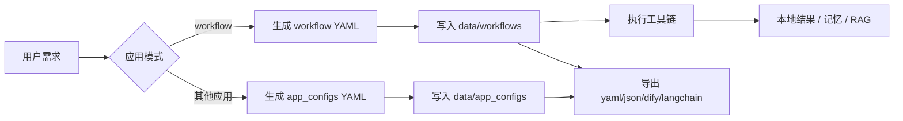

# 工作流 & 应用：需求 → 本地配置 → 多格式导出

PrivateLocalAgent 的**工作流自动化代理**按 Dify / LangChain 同类能力设计（不绑定单一厂商）：
给出自然语言需求后，在本地自动生成可执行配置，并可导出多种格式。其他五个应用复用同一模式。

## 总流程



## 1. 工作流自动化代理

| 步骤 | 动作 | 产出 |
|------|------|------|
| 1 | 说「设计工作流：…」 | `data/workflows/<id>.yaml` |
| 2 | 自动导出 | `data/exports/workflows/<id>/`（yaml/json/dify/langchain） |
| 3 | 说「执行工作流 \<id\>」或触发关键词 | 按步骤调用本地工具 |
| 4 | 说「导出工作流 \<id\>」 | 重新导出多格式 |

内置模板（首次启动写入磁盘）：`leave_request` / `it_onboarding` / `security_selfcheck` / `dev_handoff`。

### UI 示例

- `设计工作流：新员工入职要开通VPN、邮箱和知识库权限`
- `导出工作流 it_onboarding`
- `帮我跑入职IT开通工作流`

### CLI

```bash
python scripts/build_from_requirement.py workflow "新员工入职开通VPN与邮箱"
python scripts/build_from_requirement.py export it_onboarding
```

## 2. 其他应用（同一模式）

| 模式 | 触发话术 | 本地配置目录 | 导出 |
|------|----------|--------------|------|
| 个人生产力 | `配置个人生产力助手：…` | `data/app_configs/productivity/` | yaml/json/dify/langchain |
| 企业副驾驶 | `配置企业副驾驶：…` | `data/app_configs/enterprise/` | 同上 |
| 本地 RAG | `配置本地知识助理：…` | `data/app_configs/rag/` | 同上 |
| 开发者代理 | `配置开发者代理：…` | `data/app_configs/developer/` | 同上 |
| 多代理系统 | `配置多代理路由：…` | `data/app_configs/multi/` | 同上 |

导出目录：`data/exports/apps/<app>/<config_id>/`。

## 3. 关键模块

| 模块 | 作用 |
|------|------|
| `src/agent/workflow_schema.py` | 可移植步骤图 schema |
| `src/agent/workflow_registry.py` | YAML 注册表 |
| `src/agent/workflow_builder.py` | 需求 → 工作流 |
| `src/agent/workflow_export.py` | 多格式导出 |
| `src/agent/workflow.py` | 执行引擎 |
| `src/apps/app_builder.py` | 各应用配置生成器 |

## 4. 与 Dify / LangChain 的关系

- **不强制依赖** Dify 或 LangChain 运行时。
- 导出的是 **兼容形态** 的 DSL / Runnable 描述，便于迁移或对照。
- 运行时始终走本地 `ToolRegistry` + Radeon/ROCm 推理，数据不出域。
